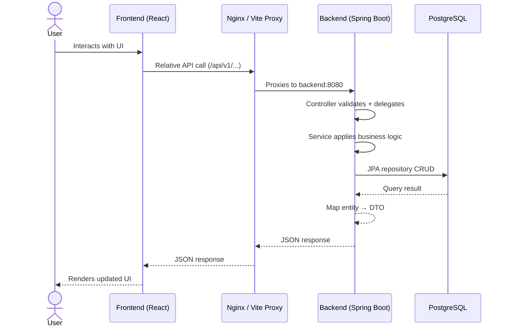
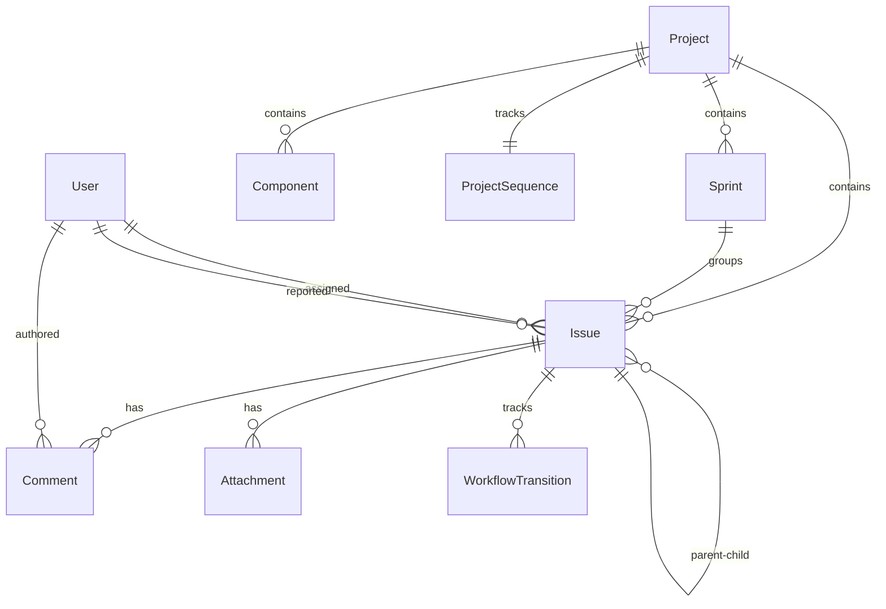

# Flowbase Jira — Java DevSecOps Pipeline

A full-featured Jira clone built with Spring Boot 3.3.5 (Java 21) and React 19, with user registration/authentication and a DevSecOps pipeline (Checkstyle, JaCoCo, SpotBugs, OWASP Dependency Check, ZAP, Gitleaks, SonarQube).

## Features

- **Issue tracking** — Epics, Stories, Tasks, Bugs, Sub-tasks with custom workflows
- **Kanban board** — Drag-and-drop issue cards grouped by status
- **Sprint management** — Plan sprints with date ranges and goals
- **Inline editing** — Edit issue summary, description, priority, assignee from the detail view
- **Search** — Quick search by issue key (`PROJ-123`) or text across all projects
- **Epic-child linking** — Link related issues under epics
- **Comments** — Add, edit, delete comments on issues
- **Attachments** — Upload and link files to issues
- **Components & Labels** — Categorize and filter issues
- **Auto-generated issue keys** — `PROJ-101`, `PROJ-102` format per project
- **Workflow transitions** — Track status changes with timestamps

## Architecture

```
┌─────────────┐       ┌──────────────┐       ┌────────────┐
│   Browser   │──────▶│   Frontend   │──────▶│   Backend  │
│ localhost:  │       │  (React +    │       │ (Spring    │
│    3000     │◀──────│   Vite/Nginx)│◀──────│  Boot 8080)│
└─────────────┘       └──────────────┘       └─────┬──────┘
                                                    │
                                                    ▼
                                            ┌────────────┐
                                            │ PostgreSQL │
                                            │  :5432     │
                                            └────────────┘
```

### Data Flow



### Entity Relationships



## Quick Start

### Prerequisites

- Java 21+
- Node.js 20+
- Docker Desktop (for PostgreSQL)
- Maven (or use `./mvnw`)

### Option 1: Docker Compose (recommended)

```bash
docker compose up -d --build
```

Opens at **http://localhost:3000**.

| Container | Port  | Purpose              |
|-----------|-------|----------------------|
| postgres  | 5432  | PostgreSQL database  |
| backend   | 8080  | Spring Boot API      |
| frontend  | 80 → 3000 | Nginx serving React |

### Option 2: Local development

**Terminal 1 — Database:**
```bash
docker run -d --name jira-postgres \
  -e POSTGRES_DB=jira -e POSTGRES_USER=jira -e POSTGRES_PASSWORD=jira \
  -p 5432:5432 postgres:16-alpine
```

**Terminal 2 — Backend:**
```bash
./mvnw spring-boot:run
```
API at **http://localhost:8080**.

**Terminal 3 — Frontend:**
```bash
cd frontend && npm install && npm run dev
```
UI at **http://localhost:3000** (Vite proxies `/api` to `:8080`).

## API Overview

All endpoints are under `/api/v1/`.

| Resource   | Key endpoints                                   |
|------------|-------------------------------------------------|
| Auth       | `POST /auth/register`, `POST /auth/login`       |
| Projects   | `GET/POST /projects`, `GET/PUT/DELETE /projects/{id}` |
| Issues     | `GET/POST /issues`, `GET/PUT/DELETE /issues/{id}`, `POST /issues/{id}/transitions` |
| Sprints    | `GET/POST /sprints`, `GET /sprints/project/{projectId}` |
| Comments   | `GET/POST /issues/{id}/comments`, `PUT/DELETE /comments/{id}` |
| Users      | `GET /users`                                    |
| Labels     | `GET/POST /labels`                              |
| Components | `GET/POST /components`, `GET /components/project/{projectId}` |
| Attachments| `POST /attachments`, `GET /attachments/issue/{issueId}` |

## Seed Data

On startup the app seeds 3 users:

| User            | Email                 | Password  |
|-----------------|-----------------------|-----------|
| Admin User      | admin@flowbase.com    | password  |
| Developer       | dev@flowbase.com      | password  |
| Product Manager | pm@flowbase.com       | password  |

## DevSecOps Pipeline

The CI/CD (disabled by default as `.github/workflows/ci-cd.yml.disabled`) runs:

1. **Checkstyle** — Code style enforcement
2. **JaCoCo** — Code coverage (≥80%)
3. **SpotBugs** — Static analysis
4. **OWASP Dependency Check** — Vulnerability scanning
5. **SonarQube** — Code quality gate
6. **Gitleaks** — Secret scanning
7. **ZAP** — DAST security testing
8. **Docker build & push** — To ECR
9. **Helm deploy** — To EKS with canary rollout

## Project Structure

```
java-pipeline/
├── src/main/java/com/flowbase/jira/
│   ├── config/          # Spring config, exception handler, data seeder
│   ├── controller/      # REST controllers (10 endpoints)
│   ├── dto/             # Request/response DTOs
│   ├── model/           # JPA entities (13 models)
│   ├── repository/      # Spring Data JPA repositories
│   └── service/         # Business logic interfaces + implementations
├── src/main/resources/
│   ├── db/migration/    # Flyway migrations
│   └── application.yml  # Environment configs
├── frontend/            # React (Vite) single-page app
│   ├── src/pages/       # Dashboard, Board, IssueDetail, CreateIssue, Sprints
│   └── nginx.conf       # Nginx config for Docker deployment
├── helm/                # Kubernetes Helm chart
├── .github/workflows/   # CI/CD pipeline (disabled)
├── docker-compose.yml   # PostgreSQL + backend + frontend
└── pom.xml              # Maven build with DevSecOps plugins
```

## Using the App

1. **Dashboard** — View project summary counts and recent activity
2. **Create a project** — Use the API or sidebar to create a project (gets auto-generated key like `SCRUM`)
3. **Plan sprints** — Navigate to Sprints page, create sprints with dates
4. **Create issues** — Click "Create Issue" from the project board, choose type (Epic/Story/Task/Bug/Sub-task)
5. **Drag & drop** — Move cards between Backlog, In Progress, In Review, Done columns
6. **Search** — Press `PROJ-123` format in the search bar to jump directly to an issue
7. **Edit inline** — Click an issue to open detail view, edit summary, description, priority, assignee, sprint, story points
